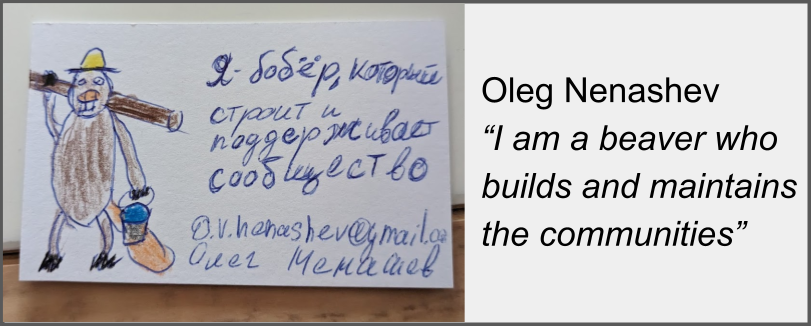

# Hello, world! 👋

I am a community builder, open source contributor and advocate.
I work on Gradle, Jenkins, WireMock and Testcontainers open-source projects, and also do open source consulting.
Alumni of CloudBees, SPbSPU, Synopsys, WireMock, Dynatrace, and Intel Labs.
**TL;DR:** Hardware engineer turned CI/CD systems admin turned developer tools engineer turned open source community leader.

I am Russian, and I stand with Ukraine in the outgoing war.
I contribute to the military and humanitarian support for Ukraine,
and also participate in the Russian anti-war organizations.
**`#StandWithUkraine`**

**Quick links:**
[Twitter](https://twitter.com/oleg_nenashev) |
[LinkedIn](https://www.linkedin.com/in/onenashev/) |
[Public Speaking](./speaking) |
[Want to hire me?](./job) |
[More links](https://linktr.ee/onenashev)

## My interests

I used to be rather a classic introvert engineer in the past.
In 2018 I realized that I am more interested in working directly with end users and contributors, and helping them by facilitating changes and unblocking contributions.
So, welcome to community, product and project management career.
Whether I work on private or open source projects,
I follow the collaborative approach and try to build and grow communities
around the area of my work.
And yes, I am a big supporter of [InnerSource](https://innersourcecommons.org/).

## My communities and projects

**Jenkins** is the first open source community I joined.
No regrets, it has been a great experience!
In [Jenkins](http://jenkins.io/) I am a community builder, core maintainer, board member, event officer, and holder of many roles. 
I am not a mother of dragons, but I am definitely a father of bugs 😊
My goal is to make the Jenkins community the best place to participate,
and to ensure long term evolution of the project and its community.
Always [looking for contributors](https://www.jenkins.io/participate), code or not!

**WireMock.** I joined it in 2023 to help with growing user and developer communities.
It is a flexible open source tool for building mock APIs and testing your client apps, started as a Java testing library.
[More about WireMock](https://wiremock.org/)

**Testcontainers.** I've been using Testcontainers since 2018, and in 2023 started actively contributing to the project.
I'm a creator and maintainer of [Testcontainers for C/C++](https://github.com/testcontainers/testcontainers-c) and a contributor to other implementations and modules.

**Continuous Delivery Foundation**.
I have been a community ambassador at the [CDF](https://cd.foundation/) since its inception.
In 2021 I was also elected to join the Technical Oversight Committee.
There I facilitate technical programs among member projects (including Jenkins or Tekton),
and joint projects with the CDF end users and members.
[Full Statement](https://www.linkedin.com/feed/update/urn:li:activity:6804399697592123392/).

**Open Hardware**.
I am an open hardware enthusiast, with some experience in RISC-V and OpenRISC ecosystems.
I believe it will eat the world too 🚀
I volunteer in the [Free and Open Source Silicon (FOSSi) Foundation](https://www.fossi-foundation.org/)
and a contributor to the [LibreCores](https://www.librecores.org/) project.
I also have a PhD degree in hardware design and electronics design automation.

**Pet Projects**.
I am a co-maintainer of [Windows Service Wrapper (WinSW)](https://github.com/winsw/winsw), not so active these days 😢
In June 2021 I've also started the [FaaScinator project](https://github.com/oleg-nenashev/FaaScinator) - 
a tool that converts Java CLI apps to FaaS containers and OpenFaaS templates, powered by Quarkus.

## Self-documentation

- [Open Source](./open-source/projects/README.md)
- [Work](./job/README.md)
- [Public Speaking](./speaking/README.md)
- [Education](./education/README.md)
- [Photography](https://www.instagram.com/asciidwarf/)

## Contacts

- Social media:
  [GitHub](https://github.com/oleg-nenashev) |
  [Twitter](https://twitter.com/oleg_nenashev) |
  [LinkedIn](https://www.linkedin.com/in/onenashev/) |
  [Mastodon](https://fosstodon.org/@asciidwarf) |
  [Instagram](https://www.instagram.com/asciidwarf/)
- [Let's have a virtual coffee ☕](https://calendly.com/onenashev/virtual-coffee)
