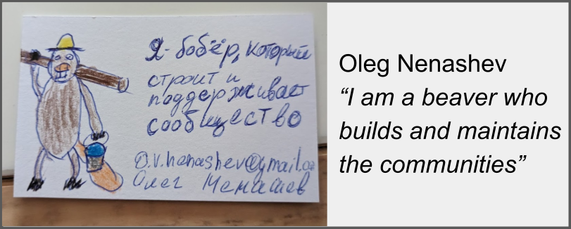

# Hello, world! 👋

I am an open-source community builder, developer productivity and DevRel consultant.
Hardware engineer turned CI/CD infra maintainer turned developer tools engineer turned open source contributor and community builder.
Some of my hats: CNCF Ambassador, Testcontainers Champion.
I'm also a former Jenkins core maintainer, CD Foundation TOC Chair, and a governance board member for the Jenkins and OpenAPI Initiative.

I work on multiple open-source projects (Jenkins, WireMock, Testcontainers, etc.) and also do open-source and DevRel consulting.
Alumnus of Gradle Technologies, WireMock, CloudBees, Synopsys, and Intel Labs.

I live in Switzerland.
I stand with Ukraine in the ongoing war.
I contribute to the military and humanitarian support for Ukraine
and also participate in the Russian anti-war organizations.
**`#StandWithUkraine`** **`#RussiansAgainstPutin`**

**Quick links:**
[Twitter](https://twitter.com/oleg_nenashev) |
[LinkedIn](https://www.linkedin.com/in/onenashev/) |
[Public Speaking](https://oleg.swiss/speaking/) |
[Want to hire me?](https://oleg.swiss/consulting/) |
[More links](https://linktr.ee/onenashev)

## Self-Documentation

- [Open Source](https://oleg.swiss/open-source/projects/)
- [Consulting](https://oleg.swiss/consulting/)
- [Public Speaking](https://oleg.swiss/speaking/)

## Contacts

- Social media:
  [GitHub](https://github.com/oleg-nenashev) |
  [Twitter](https://twitter.com/oleg_nenashev) |
  [LinkedIn](https://www.linkedin.com/in/onenashev/) |
  [Instagram](https://www.instagram.com/asciidwarf/)
- [Let's have a virtual coffee ☕](https://calendly.com/onenashev/virtual-coffee)
