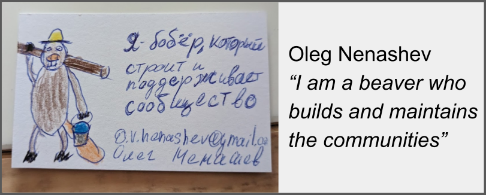

# Hello, world! 👋

I am a community builder, open source contributor and advocate.
I work on Jenkins, WireMock and Testcontainers open-source projects, and also do open source consulting.
Alumni of CloudBees, SPbSPU, SynopsysDynatrace, and Intel Labs.
**TL;DR:** Hardware engineer turned CI/CD systems admin turned developer tools engineer turned open source community leader.

**Quick links:**
[Twitter](https://twitter.com/oleg_nenashev) |
[LinkedIn](https://www.linkedin.com/in/onenashev/) |
[Public Speaking](./speaking) |
[Want to hire me?](./job) |
[More links](https://linktr.ee/onenashev)

## Self-documentation

- [Open Source](./open-source/projects/README.md)
- [Work](./job/README.md)
- [Public Speaking](./speaking/README.md)
- [Education](./education/README.md)
- [Photography](https://www.instagram.com/asciidwarf/)

## Contacts

- Social media:
  [GitHub](https://github.com/oleg-nenashev) |
  [Twitter](https://twitter.com/oleg_nenashev) |
  [LinkedIn](https://www.linkedin.com/in/onenashev/) |
  [Mastodon](https://fosstodon.org/@asciidwarf) |
  [Instagram](https://www.instagram.com/asciidwarf/)
- [Let's have a virtual coffee ☕](https://calendly.com/onenashev/virtual-coffee)
