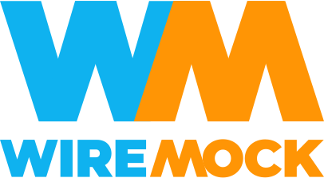
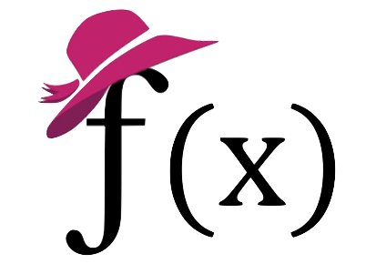
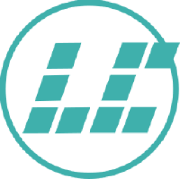

# My Open Source Projects

## Jenkins

[Jenkins](http://jenkins.io/) is the first open source community I joined.
No regrets, it has been a great experience!
I am a community builder, core maintainer, board member, event officer, and holder of many roles.
I am not a mother of dragons, but I am definitely a father of bugs 😊
My goal is to make the Jenkins community the best place to participate,
and to ensure long term evolution of the project and its community.
Always [looking for contributors](https://www.jenkins.io/participate), code or not!

## Testcontainers

I've been using Testcontainers since 2018, and in 2023 started actively contributing to the project.
I'm a creator and maintainer of [Testcontainers for C/C++](https://github.com/testcontainers/testcontainers-c) and a contributor to other implementations and modules.

## WireMock

I joined WireMock in 2023 to help with growing user and developer communities.
It is a flexible open source tool for building mock APIs and testing your client apps, started as a Java testing library.
[More about WireMock](https://wiremock.org/)

## Windows Service Wrapper

I am a co-maintainer of [Windows Service Wrapper (WinSW)](https://github.com/winsw/winsw), not so active these days 😢

This project was started by the Jenkins author Kohsuke Kawaguchi.
It is being used to install Jenkins and other services as Windows services.
In 2015 I took ownership of the project in order to release WinSW 2.0
with major stability improvements.

## FaaScinator

In June 2021 I've also started the [FaaScinator project](https://github.com/oleg-nenashev/FaaScinator) -
a tool that converts Java CLI apps to FaaS containers and OpenFaaS templates,
powered by Quarkus, OpenFaaS, picocli and a few other projects.

## Former projects

### Keptn

I joined Keptn in mid-2021 as a contributor.
Keptn v1 was an event-driven orchestration and automation server for cloud native applications.
I thought it's a very promising project, and I was happy to participate as a community manager.
In June 2022 the project was promoted to the Incubating status in the CNCF.
In December 2023, Keptn v1 was EOLed and officially replaced with the
Keptn Lifecycle Toolkit.

[More about Keptn](https://keptn.sh/)

### LibreCores

LibreCores was a community hub for open-source digital hardware,
created under the umbrella of the [Free and Open Source Silicon Foundation](https://fossi-foundation.org/).
In this project I worked on LibreCores CI - a continuous integration SaaS solution,
powered by Jenkins.
The project was discontinued.

[GitHub](https://github.com/librecores)
