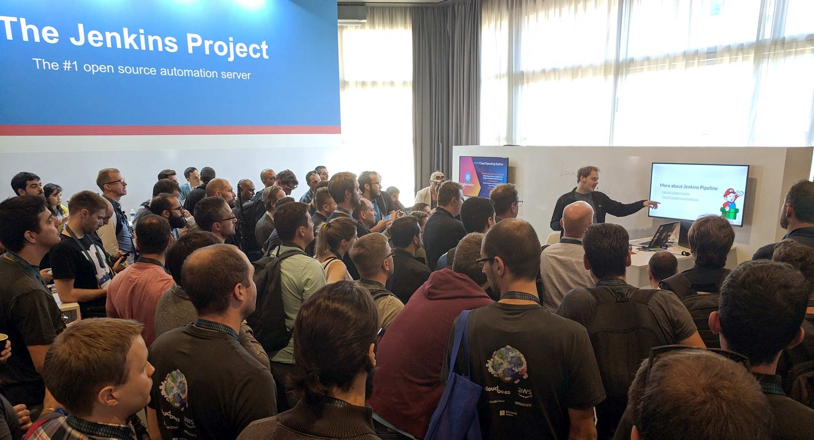
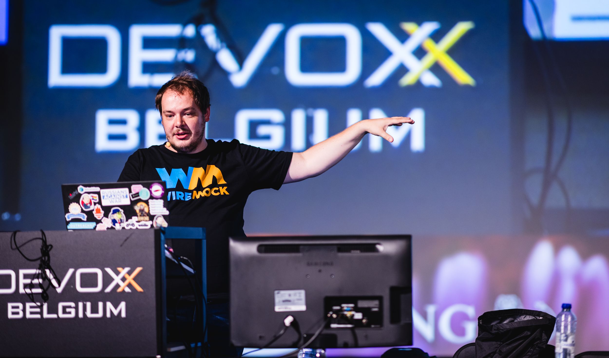

# Public Speaking

I am a CNCF/CDF ambassador and a Testcontainers champion.
I spoke at conferences including Kubecon / CloudNativeCon, Devoxx, cdCon, Community over Code, JavaPoint,
DevopsDays, Jenkins World, DevRelCon, Heisenbug, FOSS Backstage,
and many meetups across the world.

My topics include whatever open source developer tools CI/CD and observability, Jenkins, Testcontainers, WireMock, Java and developer tools, open hardware and open source community management.
I am a CNCF/CDF ambassador and a Testcontainers champion.

**Quick links:**
[My Sessionize](https://sessionize.com/onenashev) |
[My Speaker Deck](https://speakerdeck.com/onenashev) |
[More links](https://linktr.ee/onenashev)

## My Talks and Publications

See [this page](./talks.md) for the list of the key talks.

## Speaker Profile

See the speaker profile [here](./profile.md).

## Invite Me as a Speaker

I am available for speaking about open source projects and community building at in-person and online events.
I am not a traveling speaker and do it for free when possible, especially for community events and local meetups.
[Learn More](./invite-me.md)
