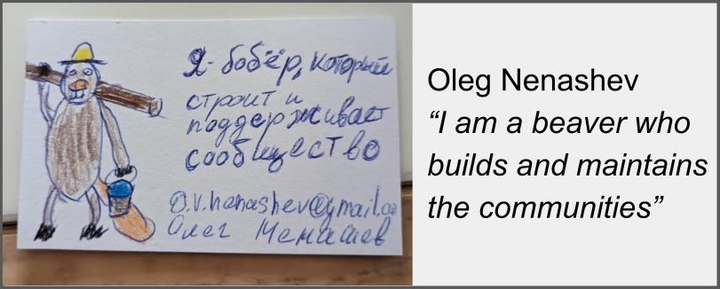

# Community Building

## My Interests

I used to be a classic introverted engineer working on automation and developer tools.
In 2018, I realized I was more interested in working directly with end users and contributors,
helping them by facilitating changes and unblocking contributions.
So, welcome to the community building, product, and project management career!

Whether I work on private or open source projects,
I try to build and grow public and internal communities.
And yes, I am a big supporter of [InnerSource](https://innersourcecommons.org/).

## Open Source Communities

- [My Open Source Projects](../open-source/projects/README.md)
- [My Open Source Organizations](../open-source/organizations/README.md)

## Non-tech communities

Coming soon

<!-- TODO - add volunteering communities -->